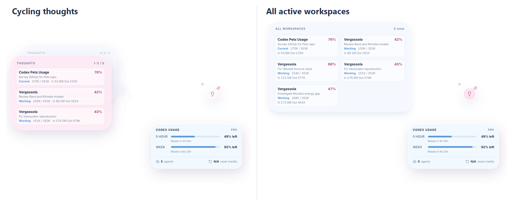

# Pet Context Companion

Pet Context Companion is a local cross-platform thought-cloud overlay for the OpenAI Codex desktop pet. It attaches itself near the native pet when Codex exposes its current anchor, cycles through recent repositories, and shows task context, subscription usage, and active-agent status. It can also speak short status briefings using the operating system's installed voices.

It is an independent community project and is not affiliated with or endorsed by OpenAI.

## What it shows

- Up to six distinct recent Codex workspaces, grouped so repeated threads from one repository do not crowd out the rest.
- A two-layer thought-cloud carousel that automatically cycles through all visible repositories.
- A three-step lightbulb control: cycling thoughts, all-workspaces glass layout, then a minimized lamp-only state.
- Live pet-anchor tracking, so the companion follows the Codex pet as the pet is dragged.
- Current context-window usage: `used tokens / model context window` and percentage for each visible workspace.
- Cumulative input and output tokens, plus a working or idle state for each workspace.
- A usage podium with the current 5-hour and weekly ChatGPT Codex windows, reset times, and earned reset-credit count when the account exposes them.
- The number of active local Codex agents, counted from recent working workspaces.
- Optional voice briefings, toggled with `Ctrl+Shift+V` (`Cmd+Shift+V` on macOS).

The panel reads the local Codex JSONL session files. It does not send telemetry, source code, prompts, or chat messages over the network.

## Layouts



## Install as a Codex plugin

The easiest installation is through the repo's Codex plugin marketplace:

```powershell
codex plugin marketplace add SamPetkov/pet-context-companion
codex plugin add pet-context-companion@pet-context-companion
```

Start a new Codex task and say `Start Pet Context Companion`. The plugin installs the public app into your user application-data folder and launches it beside the Codex pet. You can later say `Update Pet Context Companion` or `Check my Pet Context Companion installation`.

This is a Codex plugin rather than a ChatGPT App. A ChatGPT App runs through a remote MCP server and sandboxed widget, so it cannot launch this local overlay or read local Codex session files. No OpenAI API key is required.

## Requirements

- Windows, macOS, or Linux.
- Node.js 20 or newer.
- OpenAI Codex desktop app, signed in and used at least once.

## Run it

```powershell
git clone https://github.com/SamPetkov/pet-context-companion.git
cd pet-context-companion
npm install
npm start
```

Open or wake your Codex pet first, then launch the companion. The native pet remains untouched. On Codex installations that expose the pet anchor in local state, the cloud and usage podium are placed around it. Otherwise they appear near the lower-right of the active display.

Use `Ctrl+Shift+P` to show or hide the overlay. Use `Ctrl+Shift+V` to enable or disable voice briefings.

## Data and privacy

Codex writes session metadata and token telemetry to `%USERPROFILE%\.codex`. The companion reads only these fields from recent session records:

- `id`, `thread_name`, `updated_at`, and workspace path.
- `model_context_window` and latest `last_token_usage`.
- Aggregate `total_token_usage` input/output counts.

For the optional 5-hour/week podium, the companion asks the local Codex app-server for the documented `account/rateLimits/read` snapshot. It receives only subscription-window percentages, reset timestamps, and reset-credit availability. It deliberately does not read or render user prompts, assistant text, tool output, repository file contents, authentication data, or API keys. The fields are read locally and never leave your computer.

## Current scope

Custom Codex pet packages are artwork plus metadata; they do not execute code in the native desktop overlay. Codex desktop pets are also rendered by OpenAI's application and do not expose a public extension API. This project therefore cannot change the native pet's animation or attach HTML inside that window. Instead, it keeps the pet intact and provides a nearby companion bubble that reacts to the same local task data.

Codex session-log schemas can change. When no `token_count` event is available for a task, the panel clearly reports that context telemetry has not arrived yet instead of guessing.

## Development

```powershell
npm test
npm run check
```

The parser has fixture-based tests and accepts an alternate `CODEX_HOME` environment variable, making it straightforward to test against copied, redacted session fixtures.

## License

[MIT](LICENSE)
